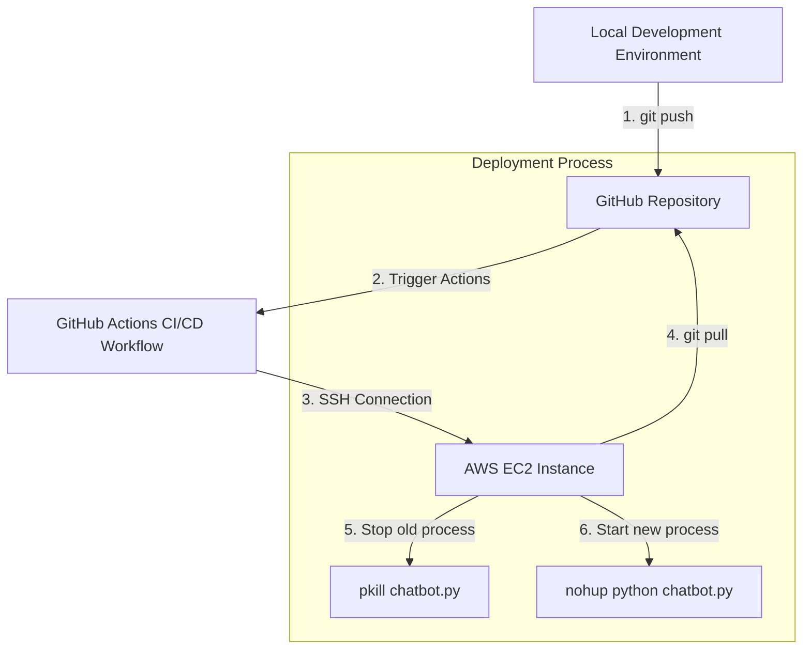

```mermaid
graph TD
    A[Local Development Environment] -->|1. git push| B[GitHub Repository]
    B -->|2. Trigger Actions| C[GitHub Actions CI/CD Workflow]
    C -->|3. SSH Connection| D[AWS EC2 Instance]
    
    subgraph E[Deployment Process]
        D -->|4. git pull| B
        D -->|5. Stop old process| F[pkill chatbot.py]
        D -->|6. Start new process| G[nohup python chatbot.py]
    end
```
