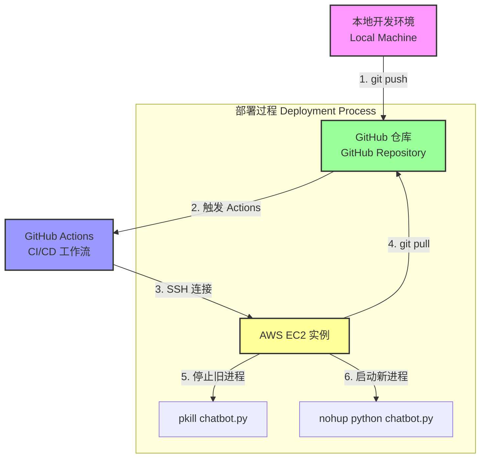

```mermaid
graph TD
    A[本地开发环境<br/>Local Machine] -->|1. git push| B[GitHub 仓库<br/>GitHub Repository]
    B -->|2. 触发 Actions| C[GitHub Actions<br/>CI/CD 工作流]
    C -->|3. SSH 连接| D[AWS EC2 实例]
    
    subgraph E[部署过程 Deployment Process]
        D -->|4. git pull| B
        D -->|5. 停止旧进程| F[pkill chatbot.py]
        D -->|6. 启动新进程| G[nohup python chatbot.py]
    end
    
    style A fill:#f9f,stroke:#333,stroke-width:2px
    style B fill:#9f9,stroke:#333,stroke-width:2px
    style C fill:#99f,stroke:#333,stroke-width:2px
    style D fill:#ff9,stroke:#333,stroke-width:2px
```
